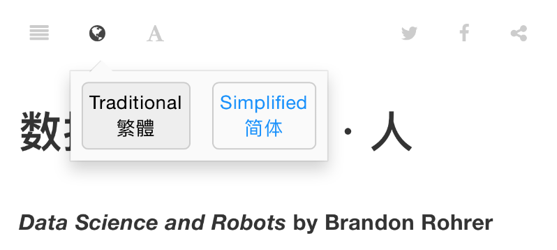

# 中文简繁转换说明

**Switching between Simplified and Traditional Mandarin**

数据科学・机器・人上的许多文章都由繁体中文所写成。为了方便不同国家和地区的读者，在每篇文章最上方的导览列里，都有一个用于切换繁体和简体中文的图标，可以轻易变更文章的显示语言。

本功能藉 GitBook 的[多语言功能](https://toolchain.gitbook.com/languages.html)和 [OpenCC](https://github.com/BYVoid/OpenCC) 所完成，非常感谢原作者。原先采用的解决方案为 [`gitbook-plugin-fanjian`](https://www.npmjs.com/package/gitbook-plugin-fanjian) 的逐字比对。使用时需注意的事情包括：

* 文章网址分为 `zh-Hant`（繁体中文）和 `zh-Hans`（简体中文）。部分链接可能因此失效，请见谅
* 某些字词的转换上可能不尽完美，请多包涵和指教
* 切换图标有时会消失。暂时的解决方法是重新加载文章

Jimmy，于 2017 年 6 月 7 日

